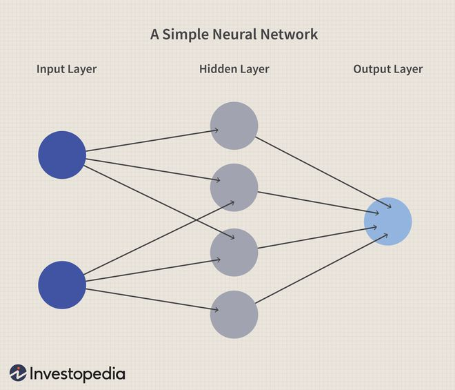

# Bienvenidos a Markdown
## Subtitulo
### subsubtitulo
#### subsubsubtitulo
##### subsubsubtitulo

texto normal
---
---
# Listas/viñetas
- Vi 1
- Vi 2
    - viñeta 2.1
    - **negritas**
    - *italica*
    - ~tachado~
    - `quoted`
---
# Deep Learning

:max_bytes(150000):strip_icc()/dotdash_Final_Neural_Network_Apr_2020-01-5f4088dfda4c49d99a4d927c9a3a5ba0.jpg)
---
---
# Deep Learning mood

---
---
# Hiper

<https://www.unam.mx>
<fb.verify.com@gmail.com>
yo asisto a la [fi](http://www.fi-b.unam.mx)
---
---
# TABLE

|Tit 1|tit 2|tit 3|
|---|---|---|
|info|info|info|

