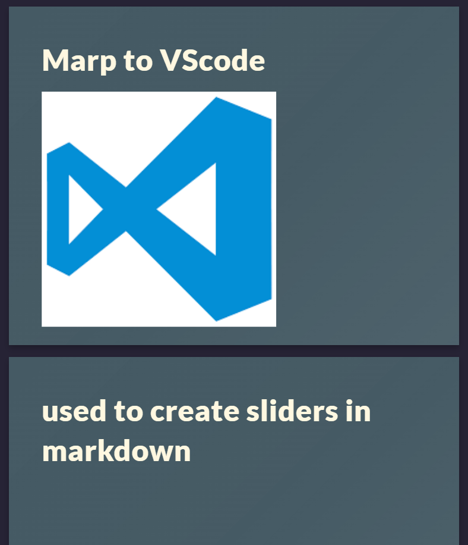
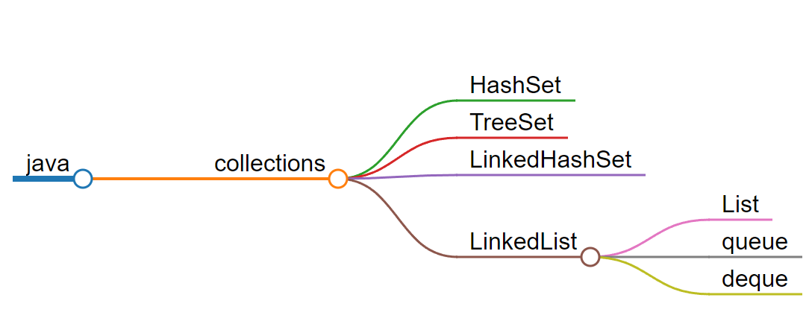
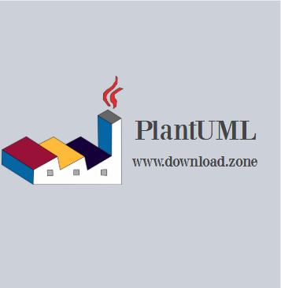
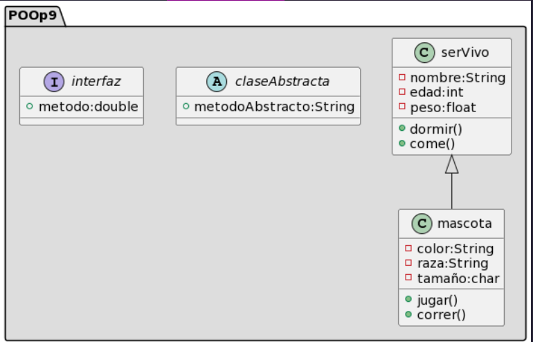

# Marp to VScode

---
---
# used to create sliders in markdown:

:smirk:
---
---
### Marpit is designed to output minimum assets for the slide deck. You can use the bare assets as a logicless slide deck, but mainly we expect to integrate output with other tools and applications.
---

# Markmap :heart_eyes:

---
---
#### allows you to create mental maps through mark down

---
---
# Plant UML :unamused:

---
---
##### is an open source tool that allows users to create diagrams from a plain text language. In addition to various UML diagrams, PlantUML has support for various other formats related to software development, as well as display of JSON and YAML files.
